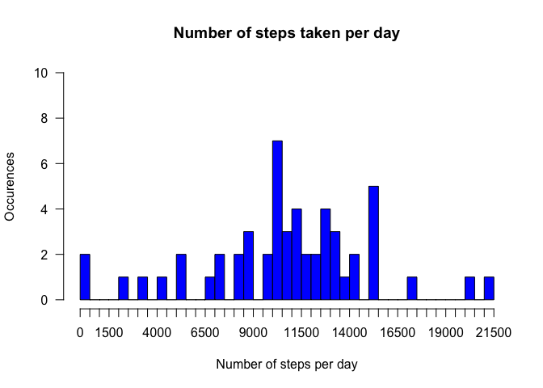
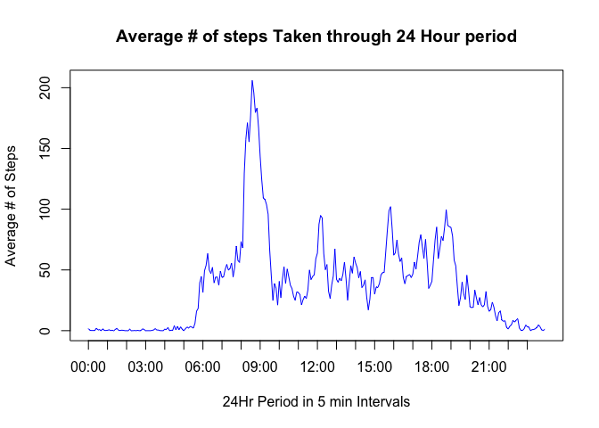
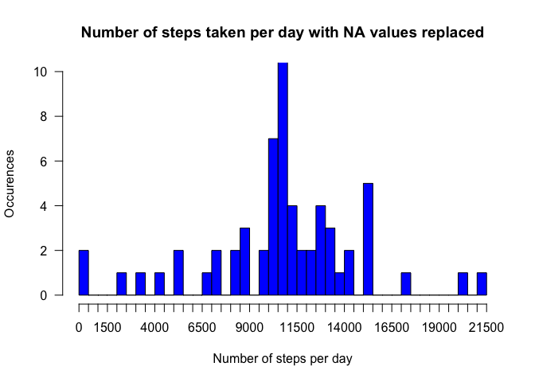
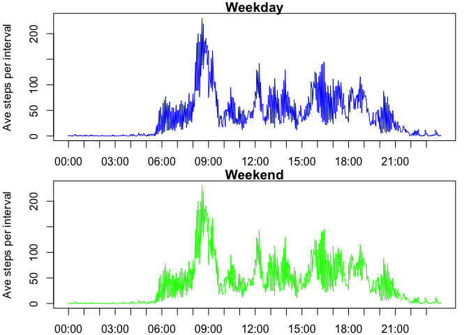

# Reproducible Research: Peer Assessment 1

## Loading and preprocessing the data

Assume that the activity dataset is in the current directory, the following code
will load and process the data.


```r
# load packages
suppressMessages(library(dplyr))
suppressMessages(library(data.table))
suppressMessages(library(xtable))
suppressMessages(library(knitr))
library(dplyr)
library(data.table)
library(xtable)
library(knitr)

activity <- read.csv("activity.csv", header = TRUE)

# Convert the read in date data to class Date
activity$date <- as.Date(activity$date)

# Convert step data to type numeric
activity$steps <- as.numeric(activity$steps)

# Fixed the interval character width field to 4.  Needed for the next steps in the formatting
activity$hour_minutes <- sprintf("%04d", activity$interval)

# Format the new hour_minutes field in the format 00:00 so that it can be converted to POSIX class
activity$hour_minutes <- format(strptime(activity$hour_minutes, format="%H%M"), format = "%H:%M")

# Format a new datetime column with the date and hour_minutes columns converted to POSIXct class
activity$datetime <- as.POSIXct(paste(activity$date, activity$hour_minutes), format = "%Y-%m-%d %H:%M")
```

## What is mean total number of steps taken per day?

I utilized the dplyr package to summarise the number of steps taken by day.


```r
sum_steps <- activity %>%
    group_by(date) %>%
    summarise(Sum_steps = sum(steps, na.rm=TRUE))
```

Here are the first 10 rows of the output table and the r code to display the table


```r
library(xtable)
sum_steps$date <- as.character(sum_steps$date)
sum_steps_xt <- xtable(sum_steps[1:10, ], comment = FALSE, auto = TRUE)
print(sum_steps_xt, type = "html", include.rownames = FALSE)
```

<!-- html table generated in R 3.2.3 by xtable 1.8-0 package -->
<!-- Sun Jan 10 11:35:39 2016 -->
<table border=1>
<tr> <th> date </th> <th> Sum_steps </th>  </tr>
  <tr> <td> 2012-10-01 </td> <td align="right"> 0 </td> </tr>
  <tr> <td> 2012-10-02 </td> <td align="right"> 126 </td> </tr>
  <tr> <td> 2012-10-03 </td> <td align="right"> 11352 </td> </tr>
  <tr> <td> 2012-10-04 </td> <td align="right"> 12116 </td> </tr>
  <tr> <td> 2012-10-05 </td> <td align="right"> 13294 </td> </tr>
  <tr> <td> 2012-10-06 </td> <td align="right"> 15420 </td> </tr>
  <tr> <td> 2012-10-07 </td> <td align="right"> 11015 </td> </tr>
  <tr> <td> 2012-10-08 </td> <td align="right"> 0 </td> </tr>
  <tr> <td> 2012-10-09 </td> <td align="right"> 12811 </td> </tr>
  <tr> <td> 2012-10-10 </td> <td align="right"> 9900 </td> </tr>
   </table>
&nbsp;

The histogram showing the distribution of the total number of steps taken is shown below:


```r
hist(sum_steps$Sum_steps, main = "Number of steps taken per day", xlab = "Number of steps per day", 
     ylab = "Occurences", border = "black", col = "blue", ylim = c(0,10), las = 1, breaks = 50, xaxt = "n")
axis(side = 1, at = seq(0,21500,500), labels = seq(0,21500,500))
```

 

Utilizing the dplyr package I created a new table to calculate the mean and median
number of steps taken by day.  The mean values look accurate but the median data
is greatly affected by hours spent sleeping or resting.


```r
mean_med_steps <- activity %>%
    group_by(date) %>%
    summarise_each(funs(mean(., na.rm=TRUE), median(., na.rm=TRUE)), steps)
```

The entire table with the computed mean and median for each day is displayed below
and the r code to display the table


```r
library(xtable)
mean_med_steps$date <- as.character(mean_med_steps$date)
mean_med_steps_xt <- xtable(mean_med_steps, comment = FALSE, auto = TRUE)
print(mean_med_steps_xt, type = "html", include.rownames = FALSE)
```

<!-- html table generated in R 3.2.3 by xtable 1.8-0 package -->
<!-- Sun Jan 10 11:35:39 2016 -->
<table border=1>
<tr> <th> date </th> <th> mean </th> <th> median </th>  </tr>
  <tr> <td> 2012-10-01 </td> <td align="right">  </td> <td align="right">  </td> </tr>
  <tr> <td> 2012-10-02 </td> <td align="right"> 0.4375000 </td> <td align="right"> 0 </td> </tr>
  <tr> <td> 2012-10-03 </td> <td align="right"> 39.4166667 </td> <td align="right"> 0 </td> </tr>
  <tr> <td> 2012-10-04 </td> <td align="right"> 42.0694444 </td> <td align="right"> 0 </td> </tr>
  <tr> <td> 2012-10-05 </td> <td align="right"> 46.1597222 </td> <td align="right"> 0 </td> </tr>
  <tr> <td> 2012-10-06 </td> <td align="right"> 53.5416667 </td> <td align="right"> 0 </td> </tr>
  <tr> <td> 2012-10-07 </td> <td align="right"> 38.2465278 </td> <td align="right"> 0 </td> </tr>
  <tr> <td> 2012-10-08 </td> <td align="right">  </td> <td align="right">  </td> </tr>
  <tr> <td> 2012-10-09 </td> <td align="right"> 44.4826389 </td> <td align="right"> 0 </td> </tr>
  <tr> <td> 2012-10-10 </td> <td align="right"> 34.3750000 </td> <td align="right"> 0 </td> </tr>
  <tr> <td> 2012-10-11 </td> <td align="right"> 35.7777778 </td> <td align="right"> 0 </td> </tr>
  <tr> <td> 2012-10-12 </td> <td align="right"> 60.3541667 </td> <td align="right"> 0 </td> </tr>
  <tr> <td> 2012-10-13 </td> <td align="right"> 43.1458333 </td> <td align="right"> 0 </td> </tr>
  <tr> <td> 2012-10-14 </td> <td align="right"> 52.4236111 </td> <td align="right"> 0 </td> </tr>
  <tr> <td> 2012-10-15 </td> <td align="right"> 35.2048611 </td> <td align="right"> 0 </td> </tr>
  <tr> <td> 2012-10-16 </td> <td align="right"> 52.3750000 </td> <td align="right"> 0 </td> </tr>
  <tr> <td> 2012-10-17 </td> <td align="right"> 46.7083333 </td> <td align="right"> 0 </td> </tr>
  <tr> <td> 2012-10-18 </td> <td align="right"> 34.9166667 </td> <td align="right"> 0 </td> </tr>
  <tr> <td> 2012-10-19 </td> <td align="right"> 41.0729167 </td> <td align="right"> 0 </td> </tr>
  <tr> <td> 2012-10-20 </td> <td align="right"> 36.0937500 </td> <td align="right"> 0 </td> </tr>
  <tr> <td> 2012-10-21 </td> <td align="right"> 30.6284722 </td> <td align="right"> 0 </td> </tr>
  <tr> <td> 2012-10-22 </td> <td align="right"> 46.7361111 </td> <td align="right"> 0 </td> </tr>
  <tr> <td> 2012-10-23 </td> <td align="right"> 30.9652778 </td> <td align="right"> 0 </td> </tr>
  <tr> <td> 2012-10-24 </td> <td align="right"> 29.0104167 </td> <td align="right"> 0 </td> </tr>
  <tr> <td> 2012-10-25 </td> <td align="right"> 8.6527778 </td> <td align="right"> 0 </td> </tr>
  <tr> <td> 2012-10-26 </td> <td align="right"> 23.5347222 </td> <td align="right"> 0 </td> </tr>
  <tr> <td> 2012-10-27 </td> <td align="right"> 35.1354167 </td> <td align="right"> 0 </td> </tr>
  <tr> <td> 2012-10-28 </td> <td align="right"> 39.7847222 </td> <td align="right"> 0 </td> </tr>
  <tr> <td> 2012-10-29 </td> <td align="right"> 17.4236111 </td> <td align="right"> 0 </td> </tr>
  <tr> <td> 2012-10-30 </td> <td align="right"> 34.0937500 </td> <td align="right"> 0 </td> </tr>
  <tr> <td> 2012-10-31 </td> <td align="right"> 53.5208333 </td> <td align="right"> 0 </td> </tr>
  <tr> <td> 2012-11-01 </td> <td align="right">  </td> <td align="right">  </td> </tr>
  <tr> <td> 2012-11-02 </td> <td align="right"> 36.8055556 </td> <td align="right"> 0 </td> </tr>
  <tr> <td> 2012-11-03 </td> <td align="right"> 36.7048611 </td> <td align="right"> 0 </td> </tr>
  <tr> <td> 2012-11-04 </td> <td align="right">  </td> <td align="right">  </td> </tr>
  <tr> <td> 2012-11-05 </td> <td align="right"> 36.2465278 </td> <td align="right"> 0 </td> </tr>
  <tr> <td> 2012-11-06 </td> <td align="right"> 28.9375000 </td> <td align="right"> 0 </td> </tr>
  <tr> <td> 2012-11-07 </td> <td align="right"> 44.7326389 </td> <td align="right"> 0 </td> </tr>
  <tr> <td> 2012-11-08 </td> <td align="right"> 11.1770833 </td> <td align="right"> 0 </td> </tr>
  <tr> <td> 2012-11-09 </td> <td align="right">  </td> <td align="right">  </td> </tr>
  <tr> <td> 2012-11-10 </td> <td align="right">  </td> <td align="right">  </td> </tr>
  <tr> <td> 2012-11-11 </td> <td align="right"> 43.7777778 </td> <td align="right"> 0 </td> </tr>
  <tr> <td> 2012-11-12 </td> <td align="right"> 37.3784722 </td> <td align="right"> 0 </td> </tr>
  <tr> <td> 2012-11-13 </td> <td align="right"> 25.4722222 </td> <td align="right"> 0 </td> </tr>
  <tr> <td> 2012-11-14 </td> <td align="right">  </td> <td align="right">  </td> </tr>
  <tr> <td> 2012-11-15 </td> <td align="right"> 0.1423611 </td> <td align="right"> 0 </td> </tr>
  <tr> <td> 2012-11-16 </td> <td align="right"> 18.8923611 </td> <td align="right"> 0 </td> </tr>
  <tr> <td> 2012-11-17 </td> <td align="right"> 49.7881944 </td> <td align="right"> 0 </td> </tr>
  <tr> <td> 2012-11-18 </td> <td align="right"> 52.4652778 </td> <td align="right"> 0 </td> </tr>
  <tr> <td> 2012-11-19 </td> <td align="right"> 30.6979167 </td> <td align="right"> 0 </td> </tr>
  <tr> <td> 2012-11-20 </td> <td align="right"> 15.5277778 </td> <td align="right"> 0 </td> </tr>
  <tr> <td> 2012-11-21 </td> <td align="right"> 44.3993056 </td> <td align="right"> 0 </td> </tr>
  <tr> <td> 2012-11-22 </td> <td align="right"> 70.9270833 </td> <td align="right"> 0 </td> </tr>
  <tr> <td> 2012-11-23 </td> <td align="right"> 73.5902778 </td> <td align="right"> 0 </td> </tr>
  <tr> <td> 2012-11-24 </td> <td align="right"> 50.2708333 </td> <td align="right"> 0 </td> </tr>
  <tr> <td> 2012-11-25 </td> <td align="right"> 41.0902778 </td> <td align="right"> 0 </td> </tr>
  <tr> <td> 2012-11-26 </td> <td align="right"> 38.7569444 </td> <td align="right"> 0 </td> </tr>
  <tr> <td> 2012-11-27 </td> <td align="right"> 47.3819444 </td> <td align="right"> 0 </td> </tr>
  <tr> <td> 2012-11-28 </td> <td align="right"> 35.3576389 </td> <td align="right"> 0 </td> </tr>
  <tr> <td> 2012-11-29 </td> <td align="right"> 24.4687500 </td> <td align="right"> 0 </td> </tr>
  <tr> <td> 2012-11-30 </td> <td align="right">  </td> <td align="right">  </td> </tr>
   </table>

## What is the average daily activity pattern?

Utilizing the dplyr package I created a new table with the average number of steps
taken per day by each 5 min interval.


```r
mean_int_steps <- activity %>%
    group_by(hour_minutes) %>%
    summarise(Mean_steps = mean(steps, na.rm=TRUE))
```

The time series plot for the average number of steps by each 5min interval is
included below


```r
# Need to coerce the hour_minutes column to POSIX class in order to plot the time-series date correctly
# This will append the current date on the front of the hour_minute data but does not show up in 
# the plot
mean_int_steps$hour_minutes <- as.POSIXct(mean_int_steps$hour_minutes, format = "%H:%M")
plot(mean_int_steps$Mean_steps ~ mean_int_steps$hour_minutes, type = "l", col = "blue", xaxt = "n", 
     xlab="24Hr Period in 5 min Intervals",ylab="Average # of Steps", main = "Average # of steps Taken through 24 Hour period")

# Improve the limits and label locations on the time series plot
axis.POSIXct(1, at=seq(as.POSIXlt(min(mean_int_steps$hour_minutes)),as.POSIXlt(max(mean_int_steps$hour_minutes)), by="hour"), 
    labels=format(seq(as.POSIXlt(min(mean_int_steps$hour_minutes)),as.POSIXlt(max(mean_int_steps$hour_minutes)), by="hour"), "%H:%M"))
```

 

The entire table with the time series data for each interval is displayed below
and the r code to display the table


```r
library(xtable)
# Coerce the hour_minute data back to character so that the column data prints correctly.
mean_int_steps$hour_minutes <- as.character(mean_int_steps$hour_minutes)
# Need to strip off the date information as it's not relevant to the table data
mean_int_steps$hour_minutes <- substring(mean_int_steps$hour_minutes, 12, 19)
mean_int_steps_xt <- xtable(mean_int_steps, comment = FALSE, auto = TRUE)
print(mean_int_steps_xt, type = "html", include.rownames = FALSE)
```

<!-- html table generated in R 3.2.3 by xtable 1.8-0 package -->
<!-- Sun Jan 10 11:35:39 2016 -->
<table border=1>
<tr> <th> hour_minutes </th> <th> Mean_steps </th>  </tr>
  <tr> <td> 00:00:00 </td> <td align="right"> 1.7169811 </td> </tr>
  <tr> <td> 00:05:00 </td> <td align="right"> 0.3396226 </td> </tr>
  <tr> <td> 00:10:00 </td> <td align="right"> 0.1320755 </td> </tr>
  <tr> <td> 00:15:00 </td> <td align="right"> 0.1509434 </td> </tr>
  <tr> <td> 00:20:00 </td> <td align="right"> 0.0754717 </td> </tr>
  <tr> <td> 00:25:00 </td> <td align="right"> 2.0943396 </td> </tr>
  <tr> <td> 00:30:00 </td> <td align="right"> 0.5283019 </td> </tr>
  <tr> <td> 00:35:00 </td> <td align="right"> 0.8679245 </td> </tr>
  <tr> <td> 00:40:00 </td> <td align="right"> 0.0000000 </td> </tr>
  <tr> <td> 00:45:00 </td> <td align="right"> 1.4716981 </td> </tr>
  <tr> <td> 00:50:00 </td> <td align="right"> 0.3018868 </td> </tr>
  <tr> <td> 00:55:00 </td> <td align="right"> 0.1320755 </td> </tr>
  <tr> <td> 01:00:00 </td> <td align="right"> 0.3207547 </td> </tr>
  <tr> <td> 01:05:00 </td> <td align="right"> 0.6792453 </td> </tr>
  <tr> <td> 01:10:00 </td> <td align="right"> 0.1509434 </td> </tr>
  <tr> <td> 01:15:00 </td> <td align="right"> 0.3396226 </td> </tr>
  <tr> <td> 01:20:00 </td> <td align="right"> 0.0000000 </td> </tr>
  <tr> <td> 01:25:00 </td> <td align="right"> 1.1132075 </td> </tr>
  <tr> <td> 01:30:00 </td> <td align="right"> 1.8301887 </td> </tr>
  <tr> <td> 01:35:00 </td> <td align="right"> 0.1698113 </td> </tr>
  <tr> <td> 01:40:00 </td> <td align="right"> 0.1698113 </td> </tr>
  <tr> <td> 01:45:00 </td> <td align="right"> 0.3773585 </td> </tr>
  <tr> <td> 01:50:00 </td> <td align="right"> 0.2641509 </td> </tr>
  <tr> <td> 01:55:00 </td> <td align="right"> 0.0000000 </td> </tr>
  <tr> <td> 02:00:00 </td> <td align="right"> 0.0000000 </td> </tr>
  <tr> <td> 02:05:00 </td> <td align="right"> 0.0000000 </td> </tr>
  <tr> <td> 02:10:00 </td> <td align="right"> 1.1320755 </td> </tr>
  <tr> <td> 02:15:00 </td> <td align="right"> 0.0000000 </td> </tr>
  <tr> <td> 02:20:00 </td> <td align="right"> 0.0000000 </td> </tr>
  <tr> <td> 02:25:00 </td> <td align="right"> 0.1320755 </td> </tr>
  <tr> <td> 02:30:00 </td> <td align="right"> 0.0000000 </td> </tr>
  <tr> <td> 02:35:00 </td> <td align="right"> 0.2264151 </td> </tr>
  <tr> <td> 02:40:00 </td> <td align="right"> 0.0000000 </td> </tr>
  <tr> <td> 02:45:00 </td> <td align="right"> 0.0000000 </td> </tr>
  <tr> <td> 02:50:00 </td> <td align="right"> 1.5471698 </td> </tr>
  <tr> <td> 02:55:00 </td> <td align="right"> 0.9433962 </td> </tr>
  <tr> <td> 03:00:00 </td> <td align="right"> 0.0000000 </td> </tr>
  <tr> <td> 03:05:00 </td> <td align="right"> 0.0000000 </td> </tr>
  <tr> <td> 03:10:00 </td> <td align="right"> 0.0000000 </td> </tr>
  <tr> <td> 03:15:00 </td> <td align="right"> 0.0000000 </td> </tr>
  <tr> <td> 03:20:00 </td> <td align="right"> 0.2075472 </td> </tr>
  <tr> <td> 03:25:00 </td> <td align="right"> 0.6226415 </td> </tr>
  <tr> <td> 03:30:00 </td> <td align="right"> 1.6226415 </td> </tr>
  <tr> <td> 03:35:00 </td> <td align="right"> 0.5849057 </td> </tr>
  <tr> <td> 03:40:00 </td> <td align="right"> 0.4905660 </td> </tr>
  <tr> <td> 03:45:00 </td> <td align="right"> 0.0754717 </td> </tr>
  <tr> <td> 03:50:00 </td> <td align="right"> 0.0000000 </td> </tr>
  <tr> <td> 03:55:00 </td> <td align="right"> 0.0000000 </td> </tr>
  <tr> <td> 04:00:00 </td> <td align="right"> 1.1886792 </td> </tr>
  <tr> <td> 04:05:00 </td> <td align="right"> 0.9433962 </td> </tr>
  <tr> <td> 04:10:00 </td> <td align="right"> 2.5660377 </td> </tr>
  <tr> <td> 04:15:00 </td> <td align="right"> 0.0000000 </td> </tr>
  <tr> <td> 04:20:00 </td> <td align="right"> 0.3396226 </td> </tr>
  <tr> <td> 04:25:00 </td> <td align="right"> 0.3584906 </td> </tr>
  <tr> <td> 04:30:00 </td> <td align="right"> 4.1132075 </td> </tr>
  <tr> <td> 04:35:00 </td> <td align="right"> 0.6603774 </td> </tr>
  <tr> <td> 04:40:00 </td> <td align="right"> 3.4905660 </td> </tr>
  <tr> <td> 04:45:00 </td> <td align="right"> 0.8301887 </td> </tr>
  <tr> <td> 04:50:00 </td> <td align="right"> 3.1132075 </td> </tr>
  <tr> <td> 04:55:00 </td> <td align="right"> 1.1132075 </td> </tr>
  <tr> <td> 05:00:00 </td> <td align="right"> 0.0000000 </td> </tr>
  <tr> <td> 05:05:00 </td> <td align="right"> 1.5660377 </td> </tr>
  <tr> <td> 05:10:00 </td> <td align="right"> 3.0000000 </td> </tr>
  <tr> <td> 05:15:00 </td> <td align="right"> 2.2452830 </td> </tr>
  <tr> <td> 05:20:00 </td> <td align="right"> 3.3207547 </td> </tr>
  <tr> <td> 05:25:00 </td> <td align="right"> 2.9622642 </td> </tr>
  <tr> <td> 05:30:00 </td> <td align="right"> 2.0943396 </td> </tr>
  <tr> <td> 05:35:00 </td> <td align="right"> 6.0566038 </td> </tr>
  <tr> <td> 05:40:00 </td> <td align="right"> 16.0188679 </td> </tr>
  <tr> <td> 05:45:00 </td> <td align="right"> 18.3396226 </td> </tr>
  <tr> <td> 05:50:00 </td> <td align="right"> 39.4528302 </td> </tr>
  <tr> <td> 05:55:00 </td> <td align="right"> 44.4905660 </td> </tr>
  <tr> <td> 06:00:00 </td> <td align="right"> 31.4905660 </td> </tr>
  <tr> <td> 06:05:00 </td> <td align="right"> 49.2641509 </td> </tr>
  <tr> <td> 06:10:00 </td> <td align="right"> 53.7735849 </td> </tr>
  <tr> <td> 06:15:00 </td> <td align="right"> 63.4528302 </td> </tr>
  <tr> <td> 06:20:00 </td> <td align="right"> 49.9622642 </td> </tr>
  <tr> <td> 06:25:00 </td> <td align="right"> 47.0754717 </td> </tr>
  <tr> <td> 06:30:00 </td> <td align="right"> 52.1509434 </td> </tr>
  <tr> <td> 06:35:00 </td> <td align="right"> 39.3396226 </td> </tr>
  <tr> <td> 06:40:00 </td> <td align="right"> 44.0188679 </td> </tr>
  <tr> <td> 06:45:00 </td> <td align="right"> 44.1698113 </td> </tr>
  <tr> <td> 06:50:00 </td> <td align="right"> 37.3584906 </td> </tr>
  <tr> <td> 06:55:00 </td> <td align="right"> 49.0377358 </td> </tr>
  <tr> <td> 07:00:00 </td> <td align="right"> 43.8113208 </td> </tr>
  <tr> <td> 07:05:00 </td> <td align="right"> 44.3773585 </td> </tr>
  <tr> <td> 07:10:00 </td> <td align="right"> 50.5094340 </td> </tr>
  <tr> <td> 07:15:00 </td> <td align="right"> 54.5094340 </td> </tr>
  <tr> <td> 07:20:00 </td> <td align="right"> 49.9245283 </td> </tr>
  <tr> <td> 07:25:00 </td> <td align="right"> 50.9811321 </td> </tr>
  <tr> <td> 07:30:00 </td> <td align="right"> 55.6792453 </td> </tr>
  <tr> <td> 07:35:00 </td> <td align="right"> 44.3207547 </td> </tr>
  <tr> <td> 07:40:00 </td> <td align="right"> 52.2641509 </td> </tr>
  <tr> <td> 07:45:00 </td> <td align="right"> 69.5471698 </td> </tr>
  <tr> <td> 07:50:00 </td> <td align="right"> 57.8490566 </td> </tr>
  <tr> <td> 07:55:00 </td> <td align="right"> 56.1509434 </td> </tr>
  <tr> <td> 08:00:00 </td> <td align="right"> 73.3773585 </td> </tr>
  <tr> <td> 08:05:00 </td> <td align="right"> 68.2075472 </td> </tr>
  <tr> <td> 08:10:00 </td> <td align="right"> 129.4339623 </td> </tr>
  <tr> <td> 08:15:00 </td> <td align="right"> 157.5283019 </td> </tr>
  <tr> <td> 08:20:00 </td> <td align="right"> 171.1509434 </td> </tr>
  <tr> <td> 08:25:00 </td> <td align="right"> 155.3962264 </td> </tr>
  <tr> <td> 08:30:00 </td> <td align="right"> 177.3018868 </td> </tr>
  <tr> <td> 08:35:00 </td> <td align="right"> 206.1698113 </td> </tr>
  <tr> <td> 08:40:00 </td> <td align="right"> 195.9245283 </td> </tr>
  <tr> <td> 08:45:00 </td> <td align="right"> 179.5660377 </td> </tr>
  <tr> <td> 08:50:00 </td> <td align="right"> 183.3962264 </td> </tr>
  <tr> <td> 08:55:00 </td> <td align="right"> 167.0188679 </td> </tr>
  <tr> <td> 09:00:00 </td> <td align="right"> 143.4528302 </td> </tr>
  <tr> <td> 09:05:00 </td> <td align="right"> 124.0377358 </td> </tr>
  <tr> <td> 09:10:00 </td> <td align="right"> 109.1132075 </td> </tr>
  <tr> <td> 09:15:00 </td> <td align="right"> 108.1132075 </td> </tr>
  <tr> <td> 09:20:00 </td> <td align="right"> 103.7169811 </td> </tr>
  <tr> <td> 09:25:00 </td> <td align="right"> 95.9622642 </td> </tr>
  <tr> <td> 09:30:00 </td> <td align="right"> 66.2075472 </td> </tr>
  <tr> <td> 09:35:00 </td> <td align="right"> 45.2264151 </td> </tr>
  <tr> <td> 09:40:00 </td> <td align="right"> 24.7924528 </td> </tr>
  <tr> <td> 09:45:00 </td> <td align="right"> 38.7547170 </td> </tr>
  <tr> <td> 09:50:00 </td> <td align="right"> 34.9811321 </td> </tr>
  <tr> <td> 09:55:00 </td> <td align="right"> 21.0566038 </td> </tr>
  <tr> <td> 10:00:00 </td> <td align="right"> 40.5660377 </td> </tr>
  <tr> <td> 10:05:00 </td> <td align="right"> 26.9811321 </td> </tr>
  <tr> <td> 10:10:00 </td> <td align="right"> 42.4150943 </td> </tr>
  <tr> <td> 10:15:00 </td> <td align="right"> 52.6603774 </td> </tr>
  <tr> <td> 10:20:00 </td> <td align="right"> 38.9245283 </td> </tr>
  <tr> <td> 10:25:00 </td> <td align="right"> 50.7924528 </td> </tr>
  <tr> <td> 10:30:00 </td> <td align="right"> 44.2830189 </td> </tr>
  <tr> <td> 10:35:00 </td> <td align="right"> 37.4150943 </td> </tr>
  <tr> <td> 10:40:00 </td> <td align="right"> 34.6981132 </td> </tr>
  <tr> <td> 10:45:00 </td> <td align="right"> 28.3396226 </td> </tr>
  <tr> <td> 10:50:00 </td> <td align="right"> 25.0943396 </td> </tr>
  <tr> <td> 10:55:00 </td> <td align="right"> 31.9433962 </td> </tr>
  <tr> <td> 11:00:00 </td> <td align="right"> 31.3584906 </td> </tr>
  <tr> <td> 11:05:00 </td> <td align="right"> 29.6792453 </td> </tr>
  <tr> <td> 11:10:00 </td> <td align="right"> 21.3207547 </td> </tr>
  <tr> <td> 11:15:00 </td> <td align="right"> 25.5471698 </td> </tr>
  <tr> <td> 11:20:00 </td> <td align="right"> 28.3773585 </td> </tr>
  <tr> <td> 11:25:00 </td> <td align="right"> 26.4716981 </td> </tr>
  <tr> <td> 11:30:00 </td> <td align="right"> 33.4339623 </td> </tr>
  <tr> <td> 11:35:00 </td> <td align="right"> 49.9811321 </td> </tr>
  <tr> <td> 11:40:00 </td> <td align="right"> 42.0377358 </td> </tr>
  <tr> <td> 11:45:00 </td> <td align="right"> 44.6037736 </td> </tr>
  <tr> <td> 11:50:00 </td> <td align="right"> 46.0377358 </td> </tr>
  <tr> <td> 11:55:00 </td> <td align="right"> 59.1886792 </td> </tr>
  <tr> <td> 12:00:00 </td> <td align="right"> 63.8679245 </td> </tr>
  <tr> <td> 12:05:00 </td> <td align="right"> 87.6981132 </td> </tr>
  <tr> <td> 12:10:00 </td> <td align="right"> 94.8490566 </td> </tr>
  <tr> <td> 12:15:00 </td> <td align="right"> 92.7735849 </td> </tr>
  <tr> <td> 12:20:00 </td> <td align="right"> 63.3962264 </td> </tr>
  <tr> <td> 12:25:00 </td> <td align="right"> 50.1698113 </td> </tr>
  <tr> <td> 12:30:00 </td> <td align="right"> 54.4716981 </td> </tr>
  <tr> <td> 12:35:00 </td> <td align="right"> 32.4150943 </td> </tr>
  <tr> <td> 12:40:00 </td> <td align="right"> 26.5283019 </td> </tr>
  <tr> <td> 12:45:00 </td> <td align="right"> 37.7358491 </td> </tr>
  <tr> <td> 12:50:00 </td> <td align="right"> 45.0566038 </td> </tr>
  <tr> <td> 12:55:00 </td> <td align="right"> 67.2830189 </td> </tr>
  <tr> <td> 13:00:00 </td> <td align="right"> 42.3396226 </td> </tr>
  <tr> <td> 13:05:00 </td> <td align="right"> 39.8867925 </td> </tr>
  <tr> <td> 13:10:00 </td> <td align="right"> 43.2641509 </td> </tr>
  <tr> <td> 13:15:00 </td> <td align="right"> 40.9811321 </td> </tr>
  <tr> <td> 13:20:00 </td> <td align="right"> 46.2452830 </td> </tr>
  <tr> <td> 13:25:00 </td> <td align="right"> 56.4339623 </td> </tr>
  <tr> <td> 13:30:00 </td> <td align="right"> 42.7547170 </td> </tr>
  <tr> <td> 13:35:00 </td> <td align="right"> 25.1320755 </td> </tr>
  <tr> <td> 13:40:00 </td> <td align="right"> 39.9622642 </td> </tr>
  <tr> <td> 13:45:00 </td> <td align="right"> 53.5471698 </td> </tr>
  <tr> <td> 13:50:00 </td> <td align="right"> 47.3207547 </td> </tr>
  <tr> <td> 13:55:00 </td> <td align="right"> 60.8113208 </td> </tr>
  <tr> <td> 14:00:00 </td> <td align="right"> 55.7547170 </td> </tr>
  <tr> <td> 14:05:00 </td> <td align="right"> 51.9622642 </td> </tr>
  <tr> <td> 14:10:00 </td> <td align="right"> 43.5849057 </td> </tr>
  <tr> <td> 14:15:00 </td> <td align="right"> 48.6981132 </td> </tr>
  <tr> <td> 14:20:00 </td> <td align="right"> 35.4716981 </td> </tr>
  <tr> <td> 14:25:00 </td> <td align="right"> 37.5471698 </td> </tr>
  <tr> <td> 14:30:00 </td> <td align="right"> 41.8490566 </td> </tr>
  <tr> <td> 14:35:00 </td> <td align="right"> 27.5094340 </td> </tr>
  <tr> <td> 14:40:00 </td> <td align="right"> 17.1132075 </td> </tr>
  <tr> <td> 14:45:00 </td> <td align="right"> 26.0754717 </td> </tr>
  <tr> <td> 14:50:00 </td> <td align="right"> 43.6226415 </td> </tr>
  <tr> <td> 14:55:00 </td> <td align="right"> 43.7735849 </td> </tr>
  <tr> <td> 15:00:00 </td> <td align="right"> 30.0188679 </td> </tr>
  <tr> <td> 15:05:00 </td> <td align="right"> 36.0754717 </td> </tr>
  <tr> <td> 15:10:00 </td> <td align="right"> 35.4905660 </td> </tr>
  <tr> <td> 15:15:00 </td> <td align="right"> 38.8490566 </td> </tr>
  <tr> <td> 15:20:00 </td> <td align="right"> 45.9622642 </td> </tr>
  <tr> <td> 15:25:00 </td> <td align="right"> 47.7547170 </td> </tr>
  <tr> <td> 15:30:00 </td> <td align="right"> 48.1320755 </td> </tr>
  <tr> <td> 15:35:00 </td> <td align="right"> 65.3207547 </td> </tr>
  <tr> <td> 15:40:00 </td> <td align="right"> 82.9056604 </td> </tr>
  <tr> <td> 15:45:00 </td> <td align="right"> 98.6603774 </td> </tr>
  <tr> <td> 15:50:00 </td> <td align="right"> 102.1132075 </td> </tr>
  <tr> <td> 15:55:00 </td> <td align="right"> 83.9622642 </td> </tr>
  <tr> <td> 16:00:00 </td> <td align="right"> 62.1320755 </td> </tr>
  <tr> <td> 16:05:00 </td> <td align="right"> 64.1320755 </td> </tr>
  <tr> <td> 16:10:00 </td> <td align="right"> 74.5471698 </td> </tr>
  <tr> <td> 16:15:00 </td> <td align="right"> 63.1698113 </td> </tr>
  <tr> <td> 16:20:00 </td> <td align="right"> 56.9056604 </td> </tr>
  <tr> <td> 16:25:00 </td> <td align="right"> 59.7735849 </td> </tr>
  <tr> <td> 16:30:00 </td> <td align="right"> 43.8679245 </td> </tr>
  <tr> <td> 16:35:00 </td> <td align="right"> 38.5660377 </td> </tr>
  <tr> <td> 16:40:00 </td> <td align="right"> 44.6603774 </td> </tr>
  <tr> <td> 16:45:00 </td> <td align="right"> 45.4528302 </td> </tr>
  <tr> <td> 16:50:00 </td> <td align="right"> 46.2075472 </td> </tr>
  <tr> <td> 16:55:00 </td> <td align="right"> 43.6792453 </td> </tr>
  <tr> <td> 17:00:00 </td> <td align="right"> 46.6226415 </td> </tr>
  <tr> <td> 17:05:00 </td> <td align="right"> 56.3018868 </td> </tr>
  <tr> <td> 17:10:00 </td> <td align="right"> 50.7169811 </td> </tr>
  <tr> <td> 17:15:00 </td> <td align="right"> 61.2264151 </td> </tr>
  <tr> <td> 17:20:00 </td> <td align="right"> 72.7169811 </td> </tr>
  <tr> <td> 17:25:00 </td> <td align="right"> 78.9433962 </td> </tr>
  <tr> <td> 17:30:00 </td> <td align="right"> 68.9433962 </td> </tr>
  <tr> <td> 17:35:00 </td> <td align="right"> 59.6603774 </td> </tr>
  <tr> <td> 17:40:00 </td> <td align="right"> 75.0943396 </td> </tr>
  <tr> <td> 17:45:00 </td> <td align="right"> 56.5094340 </td> </tr>
  <tr> <td> 17:50:00 </td> <td align="right"> 34.7735849 </td> </tr>
  <tr> <td> 17:55:00 </td> <td align="right"> 37.4528302 </td> </tr>
  <tr> <td> 18:00:00 </td> <td align="right"> 40.6792453 </td> </tr>
  <tr> <td> 18:05:00 </td> <td align="right"> 58.0188679 </td> </tr>
  <tr> <td> 18:10:00 </td> <td align="right"> 74.6981132 </td> </tr>
  <tr> <td> 18:15:00 </td> <td align="right"> 85.3207547 </td> </tr>
  <tr> <td> 18:20:00 </td> <td align="right"> 59.2641509 </td> </tr>
  <tr> <td> 18:25:00 </td> <td align="right"> 67.7735849 </td> </tr>
  <tr> <td> 18:30:00 </td> <td align="right"> 77.6981132 </td> </tr>
  <tr> <td> 18:35:00 </td> <td align="right"> 74.2452830 </td> </tr>
  <tr> <td> 18:40:00 </td> <td align="right"> 85.3396226 </td> </tr>
  <tr> <td> 18:45:00 </td> <td align="right"> 99.4528302 </td> </tr>
  <tr> <td> 18:50:00 </td> <td align="right"> 86.5849057 </td> </tr>
  <tr> <td> 18:55:00 </td> <td align="right"> 85.6037736 </td> </tr>
  <tr> <td> 19:00:00 </td> <td align="right"> 84.8679245 </td> </tr>
  <tr> <td> 19:05:00 </td> <td align="right"> 77.8301887 </td> </tr>
  <tr> <td> 19:10:00 </td> <td align="right"> 58.0377358 </td> </tr>
  <tr> <td> 19:15:00 </td> <td align="right"> 53.3584906 </td> </tr>
  <tr> <td> 19:20:00 </td> <td align="right"> 36.3207547 </td> </tr>
  <tr> <td> 19:25:00 </td> <td align="right"> 20.7169811 </td> </tr>
  <tr> <td> 19:30:00 </td> <td align="right"> 27.3962264 </td> </tr>
  <tr> <td> 19:35:00 </td> <td align="right"> 40.0188679 </td> </tr>
  <tr> <td> 19:40:00 </td> <td align="right"> 30.2075472 </td> </tr>
  <tr> <td> 19:45:00 </td> <td align="right"> 25.5471698 </td> </tr>
  <tr> <td> 19:50:00 </td> <td align="right"> 45.6603774 </td> </tr>
  <tr> <td> 19:55:00 </td> <td align="right"> 33.5283019 </td> </tr>
  <tr> <td> 20:00:00 </td> <td align="right"> 19.6226415 </td> </tr>
  <tr> <td> 20:05:00 </td> <td align="right"> 19.0188679 </td> </tr>
  <tr> <td> 20:10:00 </td> <td align="right"> 19.3396226 </td> </tr>
  <tr> <td> 20:15:00 </td> <td align="right"> 33.3396226 </td> </tr>
  <tr> <td> 20:20:00 </td> <td align="right"> 26.8113208 </td> </tr>
  <tr> <td> 20:25:00 </td> <td align="right"> 21.1698113 </td> </tr>
  <tr> <td> 20:30:00 </td> <td align="right"> 27.3018868 </td> </tr>
  <tr> <td> 20:35:00 </td> <td align="right"> 21.3396226 </td> </tr>
  <tr> <td> 20:40:00 </td> <td align="right"> 19.5471698 </td> </tr>
  <tr> <td> 20:45:00 </td> <td align="right"> 21.3207547 </td> </tr>
  <tr> <td> 20:50:00 </td> <td align="right"> 32.3018868 </td> </tr>
  <tr> <td> 20:55:00 </td> <td align="right"> 20.1509434 </td> </tr>
  <tr> <td> 21:00:00 </td> <td align="right"> 15.9433962 </td> </tr>
  <tr> <td> 21:05:00 </td> <td align="right"> 17.2264151 </td> </tr>
  <tr> <td> 21:10:00 </td> <td align="right"> 23.4528302 </td> </tr>
  <tr> <td> 21:15:00 </td> <td align="right"> 19.2452830 </td> </tr>
  <tr> <td> 21:20:00 </td> <td align="right"> 12.4528302 </td> </tr>
  <tr> <td> 21:25:00 </td> <td align="right"> 8.0188679 </td> </tr>
  <tr> <td> 21:30:00 </td> <td align="right"> 14.6603774 </td> </tr>
  <tr> <td> 21:35:00 </td> <td align="right"> 16.3018868 </td> </tr>
  <tr> <td> 21:40:00 </td> <td align="right"> 8.6792453 </td> </tr>
  <tr> <td> 21:45:00 </td> <td align="right"> 7.7924528 </td> </tr>
  <tr> <td> 21:50:00 </td> <td align="right"> 8.1320755 </td> </tr>
  <tr> <td> 21:55:00 </td> <td align="right"> 2.6226415 </td> </tr>
  <tr> <td> 22:00:00 </td> <td align="right"> 1.4528302 </td> </tr>
  <tr> <td> 22:05:00 </td> <td align="right"> 3.6792453 </td> </tr>
  <tr> <td> 22:10:00 </td> <td align="right"> 4.8113208 </td> </tr>
  <tr> <td> 22:15:00 </td> <td align="right"> 8.5094340 </td> </tr>
  <tr> <td> 22:20:00 </td> <td align="right"> 7.0754717 </td> </tr>
  <tr> <td> 22:25:00 </td> <td align="right"> 8.6981132 </td> </tr>
  <tr> <td> 22:30:00 </td> <td align="right"> 9.7547170 </td> </tr>
  <tr> <td> 22:35:00 </td> <td align="right"> 2.2075472 </td> </tr>
  <tr> <td> 22:40:00 </td> <td align="right"> 0.3207547 </td> </tr>
  <tr> <td> 22:45:00 </td> <td align="right"> 0.1132075 </td> </tr>
  <tr> <td> 22:50:00 </td> <td align="right"> 1.6037736 </td> </tr>
  <tr> <td> 22:55:00 </td> <td align="right"> 4.6037736 </td> </tr>
  <tr> <td> 23:00:00 </td> <td align="right"> 3.3018868 </td> </tr>
  <tr> <td> 23:05:00 </td> <td align="right"> 2.8490566 </td> </tr>
  <tr> <td> 23:10:00 </td> <td align="right"> 0.0000000 </td> </tr>
  <tr> <td> 23:15:00 </td> <td align="right"> 0.8301887 </td> </tr>
  <tr> <td> 23:20:00 </td> <td align="right"> 0.9622642 </td> </tr>
  <tr> <td> 23:25:00 </td> <td align="right"> 1.5849057 </td> </tr>
  <tr> <td> 23:30:00 </td> <td align="right"> 2.6037736 </td> </tr>
  <tr> <td> 23:35:00 </td> <td align="right"> 4.6981132 </td> </tr>
  <tr> <td> 23:40:00 </td> <td align="right"> 3.3018868 </td> </tr>
  <tr> <td> 23:45:00 </td> <td align="right"> 0.6415094 </td> </tr>
  <tr> <td> 23:50:00 </td> <td align="right"> 0.2264151 </td> </tr>
  <tr> <td> 23:55:00 </td> <td align="right"> 1.0754717 </td> </tr>
   </table>
&nbsp;

From both the plot and inspection of the raw data, you can see the peak average number 
of steps taken **occurs between 8:30 to 8:35.**

## Imputing missing values

There is a signficant amount of days where the activity monitor was not worn or
taken off resulting in no data collection.  To replace the NA data values I 
created a replacement vector which repeats the average number of steps taken 
for each 5 min interval.  I then search through the original data set using 
**which** and **is.na** to determine the row locations of the NA data.  This 
row number vector served as the map to replace the missing data with the 
average for that interval.  I then looked for all the row locations which 
were not NA and copied the original data into the new step data.  Following 
the assignment outline I created a new data table named **activity_new**.
Instead of writing over the original step data I created a new column
named **new_steps** with the NA values overwritten with the average for that
interval.  In anticipation of the next section I also included the code to
create the dayofweek column which is a factor with 2 levels, either
weekend or weekday.


```r
# Create repeating vector of the mean steps for each 5 min interval to match the entire dataset
replace_vector <- rep(mean_int_steps$Mean_steps, 61)
# Create new dataset to replace NA values with the mean values for each interval
activity_new <- activity
# Look for is.na values in the original steps data and replace with mean values in the new steps column
activity_new$new_steps[which(is.na(activity_new$step))] <- replace_vector[which(is.na(activity_new$step))]
# Look for !is.na values and copy the original steps data into the new steps column
activity_new$new_steps[which(!is.na(activity_new$step))] <- activity_new$steps[which(!is.na(activity_new$step))]
# use ifelse and weekdays function to determine if the day is a weekday or weekend
activity_new$dayofweek <- as.factor(ifelse(weekdays(activity_new$datetime) %in% c("Saturday", "Sunday"), 'weekend', 'weekday'))
```

Using the same code previously used to compute the total number of steps taken 
per day as well as the mean and median for each day.

I utilized the dplyr package to summarise the new number of steps taken by day.


```r
sum_steps_new <- activity_new %>%
    group_by(date) %>%
    summarise(Sum_steps = sum(new_steps, na.rm=TRUE))
```

Here are the first 10 rows of the new output table and the r code to display the table


```r
library(xtable)
sum_steps_new$date <- as.character(sum_steps_new$date)
sum_steps_new_xt <- xtable(sum_steps_new[1:10, ], comment = FALSE, auto = TRUE)
print(sum_steps_new_xt, type = "html", include.rownames = FALSE)
```

<!-- html table generated in R 3.2.3 by xtable 1.8-0 package -->
<!-- Sun Jan 10 11:35:40 2016 -->
<table border=1>
<tr> <th> date </th> <th> Sum_steps </th>  </tr>
  <tr> <td> 2012-10-01 </td> <td align="right"> 10766.18867925 </td> </tr>
  <tr> <td> 2012-10-02 </td> <td align="right"> 126.00000000 </td> </tr>
  <tr> <td> 2012-10-03 </td> <td align="right"> 11352.00000000 </td> </tr>
  <tr> <td> 2012-10-04 </td> <td align="right"> 12116.00000000 </td> </tr>
  <tr> <td> 2012-10-05 </td> <td align="right"> 13294.00000000 </td> </tr>
  <tr> <td> 2012-10-06 </td> <td align="right"> 15420.00000000 </td> </tr>
  <tr> <td> 2012-10-07 </td> <td align="right"> 11015.00000000 </td> </tr>
  <tr> <td> 2012-10-08 </td> <td align="right"> 10766.18867925 </td> </tr>
  <tr> <td> 2012-10-09 </td> <td align="right"> 12811.00000000 </td> </tr>
  <tr> <td> 2012-10-10 </td> <td align="right"> 9900.00000000 </td> </tr>
   </table>
&nbsp;

The histogram showing the distribution of the new total number of steps taken is shown below:


```r
hist(sum_steps_new$Sum_steps, main = "Number of steps taken per day with NA values replaced", 
     xlab = "Number of steps per day", ylab = "Occurences", border = "black", col = "blue", ylim = c(0,10), las = 1, breaks = 50, xaxt = "n")
axis(side = 1, at = seq(0,21500,500), labels = seq(0,21500,500))
```

 

Utilizing the dplyr package I calculated the new mean and median step date
with the step data replaced.


```r
mean_med_steps_new <- activity_new %>%
    group_by(date) %>%
    summarise_each(funs(mean(., na.rm=TRUE), median(., na.rm=TRUE)), new_steps)
```

The entire table with the new computed mean and median for each day is displayed below
and the r code to display the table


```r
library(xtable)
mean_med_steps_new$date <- as.character(mean_med_steps_new$date)
mean_med_steps_new_xt <- xtable(mean_med_steps_new, comment = FALSE, auto = TRUE)
print(mean_med_steps_new_xt, type = "html", include.rownames = FALSE)
```

<!-- html table generated in R 3.2.3 by xtable 1.8-0 package -->
<!-- Sun Jan 10 11:35:40 2016 -->
<table border=1>
<tr> <th> date </th> <th> mean </th> <th> median </th>  </tr>
  <tr> <td> 2012-10-01 </td> <td align="right"> 37.3825996 </td> <td align="right"> 34.11320755 </td> </tr>
  <tr> <td> 2012-10-02 </td> <td align="right"> 0.4375000 </td> <td align="right"> 0.00000000 </td> </tr>
  <tr> <td> 2012-10-03 </td> <td align="right"> 39.4166667 </td> <td align="right"> 0.00000000 </td> </tr>
  <tr> <td> 2012-10-04 </td> <td align="right"> 42.0694444 </td> <td align="right"> 0.00000000 </td> </tr>
  <tr> <td> 2012-10-05 </td> <td align="right"> 46.1597222 </td> <td align="right"> 0.00000000 </td> </tr>
  <tr> <td> 2012-10-06 </td> <td align="right"> 53.5416667 </td> <td align="right"> 0.00000000 </td> </tr>
  <tr> <td> 2012-10-07 </td> <td align="right"> 38.2465278 </td> <td align="right"> 0.00000000 </td> </tr>
  <tr> <td> 2012-10-08 </td> <td align="right"> 37.3825996 </td> <td align="right"> 34.11320755 </td> </tr>
  <tr> <td> 2012-10-09 </td> <td align="right"> 44.4826389 </td> <td align="right"> 0.00000000 </td> </tr>
  <tr> <td> 2012-10-10 </td> <td align="right"> 34.3750000 </td> <td align="right"> 0.00000000 </td> </tr>
  <tr> <td> 2012-10-11 </td> <td align="right"> 35.7777778 </td> <td align="right"> 0.00000000 </td> </tr>
  <tr> <td> 2012-10-12 </td> <td align="right"> 60.3541667 </td> <td align="right"> 0.00000000 </td> </tr>
  <tr> <td> 2012-10-13 </td> <td align="right"> 43.1458333 </td> <td align="right"> 0.00000000 </td> </tr>
  <tr> <td> 2012-10-14 </td> <td align="right"> 52.4236111 </td> <td align="right"> 0.00000000 </td> </tr>
  <tr> <td> 2012-10-15 </td> <td align="right"> 35.2048611 </td> <td align="right"> 0.00000000 </td> </tr>
  <tr> <td> 2012-10-16 </td> <td align="right"> 52.3750000 </td> <td align="right"> 0.00000000 </td> </tr>
  <tr> <td> 2012-10-17 </td> <td align="right"> 46.7083333 </td> <td align="right"> 0.00000000 </td> </tr>
  <tr> <td> 2012-10-18 </td> <td align="right"> 34.9166667 </td> <td align="right"> 0.00000000 </td> </tr>
  <tr> <td> 2012-10-19 </td> <td align="right"> 41.0729167 </td> <td align="right"> 0.00000000 </td> </tr>
  <tr> <td> 2012-10-20 </td> <td align="right"> 36.0937500 </td> <td align="right"> 0.00000000 </td> </tr>
  <tr> <td> 2012-10-21 </td> <td align="right"> 30.6284722 </td> <td align="right"> 0.00000000 </td> </tr>
  <tr> <td> 2012-10-22 </td> <td align="right"> 46.7361111 </td> <td align="right"> 0.00000000 </td> </tr>
  <tr> <td> 2012-10-23 </td> <td align="right"> 30.9652778 </td> <td align="right"> 0.00000000 </td> </tr>
  <tr> <td> 2012-10-24 </td> <td align="right"> 29.0104167 </td> <td align="right"> 0.00000000 </td> </tr>
  <tr> <td> 2012-10-25 </td> <td align="right"> 8.6527778 </td> <td align="right"> 0.00000000 </td> </tr>
  <tr> <td> 2012-10-26 </td> <td align="right"> 23.5347222 </td> <td align="right"> 0.00000000 </td> </tr>
  <tr> <td> 2012-10-27 </td> <td align="right"> 35.1354167 </td> <td align="right"> 0.00000000 </td> </tr>
  <tr> <td> 2012-10-28 </td> <td align="right"> 39.7847222 </td> <td align="right"> 0.00000000 </td> </tr>
  <tr> <td> 2012-10-29 </td> <td align="right"> 17.4236111 </td> <td align="right"> 0.00000000 </td> </tr>
  <tr> <td> 2012-10-30 </td> <td align="right"> 34.0937500 </td> <td align="right"> 0.00000000 </td> </tr>
  <tr> <td> 2012-10-31 </td> <td align="right"> 53.5208333 </td> <td align="right"> 0.00000000 </td> </tr>
  <tr> <td> 2012-11-01 </td> <td align="right"> 37.3825996 </td> <td align="right"> 34.11320755 </td> </tr>
  <tr> <td> 2012-11-02 </td> <td align="right"> 36.8055556 </td> <td align="right"> 0.00000000 </td> </tr>
  <tr> <td> 2012-11-03 </td> <td align="right"> 36.7048611 </td> <td align="right"> 0.00000000 </td> </tr>
  <tr> <td> 2012-11-04 </td> <td align="right"> 37.3825996 </td> <td align="right"> 34.11320755 </td> </tr>
  <tr> <td> 2012-11-05 </td> <td align="right"> 36.2465278 </td> <td align="right"> 0.00000000 </td> </tr>
  <tr> <td> 2012-11-06 </td> <td align="right"> 28.9375000 </td> <td align="right"> 0.00000000 </td> </tr>
  <tr> <td> 2012-11-07 </td> <td align="right"> 44.7326389 </td> <td align="right"> 0.00000000 </td> </tr>
  <tr> <td> 2012-11-08 </td> <td align="right"> 11.1770833 </td> <td align="right"> 0.00000000 </td> </tr>
  <tr> <td> 2012-11-09 </td> <td align="right"> 37.3825996 </td> <td align="right"> 34.11320755 </td> </tr>
  <tr> <td> 2012-11-10 </td> <td align="right"> 37.3825996 </td> <td align="right"> 34.11320755 </td> </tr>
  <tr> <td> 2012-11-11 </td> <td align="right"> 43.7777778 </td> <td align="right"> 0.00000000 </td> </tr>
  <tr> <td> 2012-11-12 </td> <td align="right"> 37.3784722 </td> <td align="right"> 0.00000000 </td> </tr>
  <tr> <td> 2012-11-13 </td> <td align="right"> 25.4722222 </td> <td align="right"> 0.00000000 </td> </tr>
  <tr> <td> 2012-11-14 </td> <td align="right"> 37.3825996 </td> <td align="right"> 34.11320755 </td> </tr>
  <tr> <td> 2012-11-15 </td> <td align="right"> 0.1423611 </td> <td align="right"> 0.00000000 </td> </tr>
  <tr> <td> 2012-11-16 </td> <td align="right"> 18.8923611 </td> <td align="right"> 0.00000000 </td> </tr>
  <tr> <td> 2012-11-17 </td> <td align="right"> 49.7881944 </td> <td align="right"> 0.00000000 </td> </tr>
  <tr> <td> 2012-11-18 </td> <td align="right"> 52.4652778 </td> <td align="right"> 0.00000000 </td> </tr>
  <tr> <td> 2012-11-19 </td> <td align="right"> 30.6979167 </td> <td align="right"> 0.00000000 </td> </tr>
  <tr> <td> 2012-11-20 </td> <td align="right"> 15.5277778 </td> <td align="right"> 0.00000000 </td> </tr>
  <tr> <td> 2012-11-21 </td> <td align="right"> 44.3993056 </td> <td align="right"> 0.00000000 </td> </tr>
  <tr> <td> 2012-11-22 </td> <td align="right"> 70.9270833 </td> <td align="right"> 0.00000000 </td> </tr>
  <tr> <td> 2012-11-23 </td> <td align="right"> 73.5902778 </td> <td align="right"> 0.00000000 </td> </tr>
  <tr> <td> 2012-11-24 </td> <td align="right"> 50.2708333 </td> <td align="right"> 0.00000000 </td> </tr>
  <tr> <td> 2012-11-25 </td> <td align="right"> 41.0902778 </td> <td align="right"> 0.00000000 </td> </tr>
  <tr> <td> 2012-11-26 </td> <td align="right"> 38.7569444 </td> <td align="right"> 0.00000000 </td> </tr>
  <tr> <td> 2012-11-27 </td> <td align="right"> 47.3819444 </td> <td align="right"> 0.00000000 </td> </tr>
  <tr> <td> 2012-11-28 </td> <td align="right"> 35.3576389 </td> <td align="right"> 0.00000000 </td> </tr>
  <tr> <td> 2012-11-29 </td> <td align="right"> 24.4687500 </td> <td align="right"> 0.00000000 </td> </tr>
  <tr> <td> 2012-11-30 </td> <td align="right"> 37.3825996 </td> <td align="right"> 34.11320755 </td> </tr>
   </table>
&nbsp;

With the missing data replaced the histogram distribution was moved more towards
the overall average number of steps per day. This makes sense since the previous
days with no data are now set at the average.  Separate from the days with no data,
replacing the missing values did not have much an effect on the mean or median data.

## Are there differences in activity patterns between weekdays and weekends?

Using the **activity_new** dataset I create two new time series plots of 
average steps taken by either **weekend** or **weekday**.  The panel plot
and r code is included below.

New average step data table:

```r
ave_steps_new <- activity_new %>%
    group_by(hour_minutes, dayofweek) %>%
    summarise(Ave_steps = mean(new_steps, na.rm=TRUE))
```

Create the two new time series plots:

```r
# Need to coerce the hour_minutes column to POSIX class in order to plot the time-series date correctly
# This will append the current date on the front of the hour_minute data but does not show up in 
# the plot
ave_steps_new$hour_minutes <- as.POSIXct(ave_steps_new$hour_minutes, format = "%H:%M")
# Setup the panel for the 2 plots
par(mfcol = c(2,1))
par(mar = c(2,4,1,1))
# Subset ave_steps_new data by weekday
with(subset(ave_steps_new, dayofweek == "weekday"), plot(ave_steps_new$Ave_steps ~ ave_steps_new$hour_minutes, 
    ylab = "Ave steps per interval", xlab = "", type = "l", xaxt = "n", main = "Weekday", col = "blue"))
# Improve the limits and label locations on the time series plot
axis.POSIXct(1, at=seq(as.POSIXlt(min(ave_steps_new$hour_minutes)),as.POSIXlt(max(ave_steps_new$hour_minutes)), by="hour"), 
    labels=format(seq(as.POSIXlt(min(ave_steps_new$hour_minutes)),as.POSIXlt(max(ave_steps_new$hour_minutes)), by="hour"), "%H:%M"))

# Subset ave_steps_new data by weekend
with(subset(ave_steps_new, dayofweek == "weekend"), plot(ave_steps_new$Ave_steps ~ ave_steps_new$hour_minutes, 
    ylab = "Ave steps per interval", xlab = "", type = "l", xaxt = "n", main = "Weekend", col = "green"))
# Improve the limits and label locations on the time series plot
axis.POSIXct(1, at=seq(as.POSIXlt(min(ave_steps_new$hour_minutes)),as.POSIXlt(max(ave_steps_new$hour_minutes)), by="hour"), 
    labels=format(seq(as.POSIXlt(min(ave_steps_new$hour_minutes)),as.POSIXlt(max(ave_steps_new$hour_minutes)), by="hour"), "%H:%M"))
```

 
&nbsp;&nbsp;


The main differences in ave steps between weekends and weekdays are as follows:  
1.  The number of steps early in the day are less for weekends vs weekdays  
2.  The peak step period shifts to much later in the day for weekends  
3.  The number of steps in the evening is higher for weekends compared to weekdays  
*Assuming the 00:00 interval represents midnight for each day*
